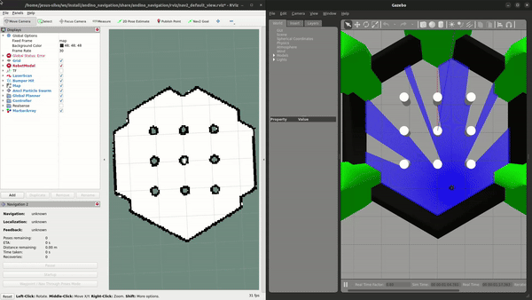

# Andino Apps

This package contains integration applications with the Andino robot.

# Applications

## Gazebo classic simulation + Nav2

A launch file for running the andino_gz_classic simulation and the Nav 2 stack is provided.
It uses the [turtlebot3_world](https://github.com/ROBOTIS-GIT/turtlebot3_simulations/tree/master) world (_Apache 2 license_) by default.

```
 ros2 launch andino_apps andino_simulation_navigation.launch.py
```

To visualize and interact with the Andino robot in RViz:

- Click in 2D pose estimate button and select the initial pose of the robot
- Click in Nav2 Goal button and select the final point.
- The robot will start to move to the selected goal.



For further information and examples you can check the [Nav2 tutorials](https://navigation.ros.org/tutorials/index.html).

This package has been tested with the Andino robot with `diff drive plugin` in Gazebo-classic.

By changing the world file, make sure to also change map file. Further navigation [parameters](params/nav2_params.yaml) tunning is recommended.
