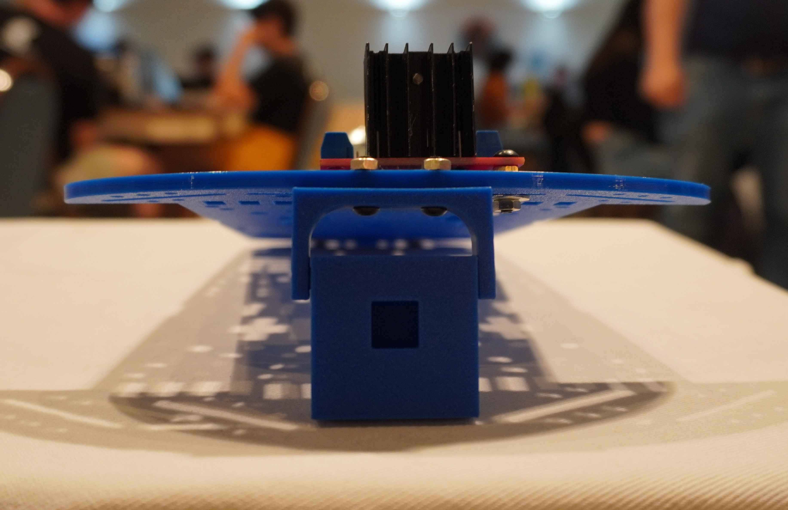

# andino_hardware

This package aims to provide the necessary information to the correct assembly of the robot.

## Bill of Materials

| Number | Module | Part | Links | Comments |
|:--:|:--:|:-----------------------:|:--------------------:|:-------------------------------------------------------:|
| 1 | SBC | Raspberry Pi 4 B (4 Gb) | [PiShop](https://www.pishop.us/product/raspberry-pi-4-model-b-2gb/), [TiendaTec](https://www.tiendatec.es/raspberry-pi/gama-raspberry-pi/1100-raspberry-pi-4-modelo-b-4gb-5056561800349.html) | If you want better performance you could buy the 8GB model |
| 2 | Chassis |  2 x Print 3d Chassis + Rubber Tyre Wheels | [Chassis](./printing_model/chassis/), [Wheels Sparkfun](https://www.sparkfun.com/products/13259) | - |
| 3 | Motors | 2 x Motor with Encoder | [Sparkfun](https://www.sparkfun.com/products/16413) | - |
| 4 | Microcontroller | Arduino Nano | [Amazon](https://www.amazon.es/RUIZHI-Interfaz-Controlador-Mejorada-Compatible/dp/B0CNGKG4MZ/ref=sr_1_6?dib=eyJ2IjoiMSJ9.gnHfW9VtlEjMns12dAyHXLyFAlaikWpFyoOQJpO0iJBR-zelggQTQ9n001SH_P6NQ9DO3gPetP2krm7GAGvJus6vz4Utqu8Hy1gol0Rq7nmtJITd70ZNi3linf9v1g1iP7MlBx98cBGLVvFy-O2kZnJ63uZDwOZzwz_kExJzUWAxroO3AjufqqGOQHswLfDfjH6jpOJt54xxpCaqurDccId2O0uGKOj6WpPz6iLSubpsPB479SWYPSncxWQzz2kO4VjT6HVzPS2uWi19TS-A9WXVZceLBiz9t25Pf39jiGQ.1sLxrQ94HdIoXBq4VcDFMZhzKoL3wyJoY-U6BmDI6fY&dib_tag=se&keywords=arduino+nano+v3&qid=1714468231&sr=8-6) | You can also use an Arduino Uno, but mind size. It should include a microUSB - USB cable. If not, you will need to purchase it.  |
| 5 | Motor Driver | L298N Dual H Bridge | [Amazon](https://www.amazon.com/Bridge-Stepper-Driver-Module-Controller/dp/B09T6K9RFZ/ref=sr_1_4?crid=37YY7JO6C3WVE&keywords=l298&qid=1685740618&sprefix=l29%2Caps%2C277&sr=8-4) | - |
| 6 | Laser Scanner | RPLidar A1M8 | [RobotShop](https://www.robotshop.com/products/rplidar-a1m8-360-degree-laser-scanner-development-kit?_pos=3&_sid=b0aefcea1&_ss=r), [Amazon](https://www.amazon.es/dp/B07VLFGT27?ref_=cm_sw_r_cso_wa_apan_dp_RJ3AZC2XCEVDK0X2DCGA&starsLeft=1&th=1) | If no microUSB-USB cable is included, you will need to purchase one |
| 7 | Camera | Raspi Camera Module V2, 8 MP | [Robotshop](https://www.robotshop.com/products/raspberry-pi-camera-module-v2), [Amazon](https://www.amazon.com/Raspberry-Pi-Camera-Module-Megapixel/dp/B01ER2SKFS?th=1), [Longer cable](https://www.amazon.es/AZDelivery-Repuesto-Raspberry-30cm-Flexkabel/dp/B01NAXKTDP/ref=sr_1_9?__mk_es_ES=%C3%85M%C3%85%C5%BD%C3%95%C3%91&crid=I1IK0FQVQCCU&dib=eyJ2IjoiMSJ9.2UYb-3a8M00iHZZiHT0xjp8vfzq-3BSmJSLxdtcCMV6WMj8g5T8T_j5DKX8cESxqnVN01YpV3nX28IuhewGTOsmJ4yF5st20TxU7kHNHftZE_aygB5vT-001wEvUfx70V0H0DZljw0YfC4R2wpjsTR_89pAA95C4F8LhJiGbbUGTEjBgmjnsRIFs6FYatZa9KVusNyv2cKxGZlav36gdoAkMXQUvX578c6frxSnH5DROCeK6bKSqrczA7R8OBVWC995fK1AxHbJLHZJEDQGXMVhUkHd2liBV0nq48mnyE6Q.nHty4TxSpldkH8FZAia_rx7sX6c2uIBpPRUEqwq5NiY&dib_tag=se&keywords=raspberry%2Bpi%2Bcamera%2Bcable&qid=1716878948&sprefix=raspberry%2Bpi%2Bcamera%2Bcable%2Caps%2C76&sr=8-9&th=1)  | A link for a longer cable (30 cm) is included, just in case the one included with the camera is too short. |
| 8 | Electrical Power Supply | Powerbank 5V | [Amazon](https://www.amazon.es/Heganus-Powerbank-10000mAh-port%C3%A1til-pr%C3%A1ctico/dp/B082PPPWXY/ref=asc_df_B082PPPWXY/?tag=googshopes-21&linkCode=df0&hvadid=420334509253&hvpos=&hvnetw=g&hvrand=13392500367381615369&hvpone=&hvptwo=&hvqmt=&hvdev=c&hvdvcmdl=&hvlocint=&hvlocphy=9181150&hvtargid=pla-878722533582&psc=1&mcid=642b7553488f350a8726c7bfb183a667&tag=&ref=&adgrpid=95757266066&hvpone=&hvptwo=&hvadid=420334509253&hvpos=&hvnetw=g&hvrand=13392500367381615369&hvqmt=&hvdev=c&hvdvcmdl=&hvlocint=&hvlocphy=9181150&hvtargid=pla-878722533582) | Any powerbank is suitable: Mind size / weight / output current(>=2A) |
| 9 | Power Step up | DC - DC boost converter | [Amazon Europe](https://www.amazon.es/Convertidor-convertidor-Controlador-almacenamiento-Transformadores/dp/B08D5XF571) | If motors support higher voltage than 5V a step-up(e.g: to 9V) can be added between powerbank (5V) and motor driver. Screw clockwise to reduce the output voltage. |
| 10 | Fixing & Mount | M3 bolts/fasteners - M3 Spacers - M2.5/2.0 bolts/fasteners for SBC | [Mercado Libre](https://articulo.mercadolibre.com.ar/MLA-823234605-kit-tornillos-electronica-500-unid-fresada-philips-m3-oferta-_JM#position=1&search_layout=stack&type=item&tracking_id=2a14497e-a3dc-4a0f-98fb-b3b524117284), [Amazon](https://www.amazon.com/Taiss-620PCS-Metric-Assortment-Washers/dp/B0CWXRG6VL/ref=sr_1_2_sspa?crid=3R3BT7LOQWZ4B&dib=eyJ2IjoiMSJ9.EBY3VtTnCGRri20ECsEwpF2eTrWOhlADXq8Rbv78LP7JVW0giUfPQ5-G3e5cVq7svNoKIPbFGf0jQoImIPuJvU72yWC0XaaXyHE03TjX1zVT-AxcCUr6bvvqnQrrwFNowZjHy2ZibnHX4sDMx3aixEmx5XUGq43KVEID5FIGzTw6xsLQd410DewktxUFWCHLSD8HR8BeAUKcP3mzciuPmc8dcz9TzY5cZ_wYFO-WyEQ.B5-OkrGZbzkIn8cw4Zb_LtQUoxX1qKuiVqI6PTNmpZk&dib_tag=se&keywords=kit+M3+tuercas+y+tornillos&qid=1714469030&sprefix=kit+m3+tuercas+y+tornillos%2Caps%2C149&sr=8-2-spons&sp_csd=d2lkZ2V0TmFtZT1zcF9hdGY&psc=1), [Spacers](https://www.amazon.es/YOKIVE-Separadores-Tornillos-Hexagonal-Consistente/dp/B0BWXL75R6/ref=sr_1_11?__mk_es_ES=%C3%85M%C3%85%C5%BD%C3%95%C3%91&crid=39R5HOTYH2AC9&dib=eyJ2IjoiMSJ9.7A-mx6__B2agU-KSbpRPhlNj2WkQfkj8OtZKEmwlwHa3NiDqUA-1Um0339r3Ssad0h03L471s08VcgBGByJpKwummUR8Sgyt3AuF4sahKIacNlyBlD8mcl3bNQ54HR8L585aepoUOxllFXUi2AEGde8kjkNqaiOEcyflppOf1eKtAtlyTYnnjOVJs5YqRK97QV3pUt1g8Rt1zLn7RsEtRrvlMQIXXBjIFFZsqK2tN7OBY2lgorgdRsXP1aS5tad9rD9vsl9SkPUx_c1Bf0ulzabNSFk19v_cSd0IwEx2zSw.30hsx31Q_-5A3eLrlOwhoTvAs_yDufCk04NiN0xk0C8&dib_tag=se&keywords=spacer+30mm+m3&qid=1716156793&refinements=p_n_free_shipping_eligible%3A20930980031&rnid=20930979031&sprefix=spacer+30mm+m3%2Caps%2C107&sr=8-11) | You will probably need to replace the default spacers for the LiDAR with M3 spacers |
| 11 | Other 3D printed parts | Camera Mount | [3D models](./printing_model/raspi_cam_mount/) | These parts are for fixing the Raspi Cam at the front of the robot |
| 12 | Caster wheel | Caster wheel | [Amazon](https://www.amazon.es/Unidades-Peque%C3%B1as-Dispositivo-Transferencia-Transporte/dp/B098XHYW7F/ref=asc_df_B098XHYW7F/?tag=googshopes-21&linkCode=df0&hvadid=529604577974&hvpos=&hvnetw=g&hvrand=15132275207682237467&hvpone=&hvptwo=&hvqmt=&hvdev=c&hvdvcmdl=&hvlocint=&hvlocphy=9181150&hvtargid=pla-1396749454795&psc=1&mcid=b1df85a65d163e89b507de60e73f9e65) | - |
| 13 | SD Card | 64 GB SD Card | [Apokin](https://www.apokin.es/tarjeta-microsd-philips-64gb-class10.html), [Amazon](https://www.amazon.es/Kingston-Tarjeta-SDCS2-64GB-Adaptador/dp/B07YGZQ4H8/ref=sr_1_7?dib=eyJ2IjoiMSJ9.zE4PI6DCNK3d78rtl5ga1NQXGwJT1jC2iqi3mXNzbdJ4BosAUPCn9gc13Gc7pdHDx-7wTy4CDj0zIlgDpu9qXH-6GLgI--pJbfi3OvTBPhwwH-tfi1OzM9xqcAOJG6pJuTtkknsyFk6Ma2EHJ4UdheaziDC_KKaWNKgsf_DFbcA-ZxQSXlTtQqwHvCzgi8hq4vKGiEIY-LSZS_sXE9IUGroo0Isl59Po2IXhTBG5IHnnsVR_7lo0dVBVFYl-5GY2CvJbrixULuPl90TbFTTP6DoIeDcpFdDTcbvSK3Lecss.WXBgIZllFgQxx13Szl3q6WIlTOliwrN8V42J1SzNJ8o&dib_tag=se&qid=1714552555&refinements=p_n_feature_browse-bin%3A948155031&s=computers&sr=1-7) | The SD Card is used to host the OS for the Raspberry Pi |
| 14 | (Optional) Plastic seals | - | - | You will need at least 2 longer ones to fix the powerbank to the upper chassis, and the shorter ones for all the wires. If you don't want to use them, you can use other method to fix the powerbank and wires |

When you gather all the parts, you should have the following (NOTE: the printed encoder wheels are no longer necessary, since the motors are equipped with an embedded encoder):


### Tooling

| Number | Tool | Links | Comments |
|:--:|:------:|:--------------------:|:-------------------------------------------------------:|
| 1 | Set of screwdrivers | [Amazon](https://www.amazon.es/Ainiv-Destornilladores-Precisi%C3%B3n-Destornillador-magnetizador/dp/B09CD1F44B/ref=asc_df_B09CD1XT57/?tag=googshopes-21&linkCode=df0&hvadid=529495276761&hvpos=&hvnetw=g&hvrand=2854754490438163902&hvpone=&hvptwo=&hvqmt=&hvdev=c&hvdvcmdl=&hvlocint=&hvlocphy=9181160&hvtargid=pla-1431590275356&mcid=4f49c0c6c8ca33b390169090ae4ad15b&th=1) | You need flat and star screwdrivers |
| 2 | Silicon Pistol | [Amazon](https://www.amazon.es/Tilswall-Pegamento-Manualidades-Bricolaje-Reparaciones/dp/B07TD1RD4R/ref=pd_ci_mcx_pspc_dp_d_2_i_1?pd_rd_w=49k0d&content-id=amzn1.sym.f11fe75a-7397-412e-9b90-7e09bf6f5c14&pf_rd_p=f11fe75a-7397-412e-9b90-7e09bf6f5c14&pf_rd_r=MA73TQJTYS2GMC7XW7YC&pd_rd_wg=Z3aRz&pd_rd_r=08e805c6-81b7-4023-8ea1-9b357536cba1&pd_rd_i=B07TD1RD4R&th=1) | This pistol should include 75 silicon bars so you won't need to purchase them separately |

## Assembly Process

  1. Screw the Motor Driver and the idler wheel to the lower chassis.

  

  Here you have a front image of how the caster wheel are mounted to the chassis:

  

  2. Screw the 3D printed parts for the Raspi Camera Module:

  

  3. Add the Arduino Nano to the back of the lower part of the chassis. It should look like this:

  

  4. Screw the Raspberry Pi and the DC-DC converter to the front of the lower part of the chassis:

  

  5. Fix the powerbank to the back of the upper part of the chassis:

  

  6. Add the RPLidar to the front of the upper part of the chassis:

  

  7. Add the IMU (WIP)

  <!-- TODO Add photo of the IMU physical implementation-->

  8. Perform all the wiring following the [Connections Diagram](#connection-diagram) of both the upper and lower chassis. Note that some of the connections may need to be done by soldering the cables.

  9.  Join both chassis together, and complete the remaining wiring to have your robot ready:

  

<a name="connection-diagram"></a>
## Connection Diagram

### Motor-Arduino


Some frequent errors:
 - If one of the motors rotates in the opposite direction (think about the orientation of the motors in the chassis) probably the output(+ and -) of the L298N's output should be toggled.
 - When moving forward the encoder values should increase while moving backwards they should decrease. If it is happening the other way around probably the A and B encoder signals should be toggled.

### Raspberry-Power


*NOTE: depending on the power bank maximum output current, the motors may need to be powered with a voltage value lower than 9V. While a higher voltage value (up to 9V) leads to smoother operation (better motor speed control), it also increases their open-loop speed, which is noticeable particularly during motion start and varies according to the power bank quality (output current capabilities). Therefore, adjusting the output voltage to lower values (around 7V) may be required so as to make the motors work as expected.

**NOTE: Ensure the ribbon cable is properly connected with the blue or silver side facing the USB ports.

## Microcontroller Configuration

For uploading the microcontroller firmware please refer to [`andino_firmware`](../andino_firmware/README.md) package.

## Single Board Computer (SBC)

The SBC used in this project is a Raspberry Pi 4b so the guidelines here will refer particularly to this family of on-board computers, however extending its use to other families is possible as well.

This section details the required configuration that is needed in the SBC.
You can either follow these steps or **rely on community contribution (Recommended) for installing this via ansible playbooks**: See https://github.com/garyservin/andino_ansible_config

### Operative System

Ubuntu Mate 22.04 ARM64 is the recommended operative system for this project. This OS provides good capabilities for a educational platform as well as good performance.

For installing this OS in the Raspberry:
1. Download the image from here: [ubuntu mate download](https://ubuntu-mate.org/download/arm64/)


2. Install OS to a microSD card using [Raspberry Pi Imager](https://www.raspberrypi.com/software/).
   - No extra configuration should be necessary.

3. Boot your raspberry using the microSD and a HDMI connection. Some initial configuration is necessary. Follow the wizard for a proper set up. It is recommended to use simple User and Password combinations for the user. For example:
    - user: pi
    - password: admin

4. Once is done, run `sudo apt update && sudo apt upgrade` in a terminal for updating the system. Then reboot.

### Installing dependencies

Some packages are necessary to be installed towards a correct set up of the robot's on-board computer.

#### ssh-server

In general, you will want to access to the Raspberry remotely via `ssh` connection while being connected in the same network.
So we need to install `ssh-server`;
```
sudo apt-get install openssh-server
```
Enable it if it is not enabled yet:
```
sudo systemctl enable ssh --now
```

After this you will be able to access this device from a remote computer by doing:
```
ssh <user>@<ip>
```
For example if the user is `pi` and the ip is `192.168.0.102`
```
ssh pi@192.168.0.102
```


#### Common utilities

Install some common utilities that will be required later on.

```
sudo apt update
```

```
sudo apt install git net-tools software-properties-common build-essential -y
```
```
sudo apt install python3-rosdep2 python3-catkin-pkg python3-catkin-pkg-modules python3-rospkg-modules python3-rospkg  -y
```

#### Install ROS

Follow suit the instructions for installing next dependencies from binaries:
 - [ROS 2 Humble](https://docs.ros.org/en/humble/Installation/Ubuntu-Install-Debians.html)
 - [Colcon](https://colcon.readthedocs.io/en/released/user/installation.html)

To automatically source ROS installation, it is recommended to add `source /opt/ros/humble/setup.bash` line to the `~/.bashrc` file.

#### Arduino

Arduino drivers are necessary for the SBC (Raspberry) <--> Microcontroller(Arduino) serial communication.

```
sudo apt install arduino
```

Configure it properly:
1. Add user to `dialout` and `plugdev` groups:
   ```
   sudo usermod -a -G dialout $USER
   ```
   ```
   sudo usermod -a -G plugdev $USER
   ```
   Note you will need a reboot after this to be effective.
2. Remove `brltty` from the system
   ```
   sudo apt remove brltty
   ```
   In Ubuntu 22.04 seems to be an issue with some chip drivers and the `brltty` daemon. To avoid this conflict we remove `brltty` as suggested. See [this stackoverflow post](https://stackoverflow.com/questions/70123431/why-would-ch341-uart-is-disconnected-from-ttyusb) for further information.


#### Raspberry Camera Module V2

After connecting the camera module to the Raspberry's camera port.
```
sudo apt install libraspberrypi-bin v4l-utils
```
```
sudo usermod -aG video $USER
```

Check camera status:
```
vcgencmd get_camera
```

If the output of the previous command is `supported=1 detected=1', everything is fine. If not, your camera won't work correctly, you need to perform some configuration first.

Modify the `config.txt` file for the boot:

```sh
 sudo nano /boot/firmware/config.txt
```

And add these lines:

```
# Autoload overlays for any recognized cameras or displays that are attached
# to the CSI/DSI ports. Please note this is for libcamera support, *not* for
# the legacy camera stack
start_x=1
gpu_mem=128
```

Save and close the file. Then we need to enable the camera support for the raspberry:

```sh
sudo raspi-config
```

Go to `Interface Options`, select `camera` and enable it.

Finally, you just need to reboot and the camera should be working fine.

#### RPLidar installation

The installation of the A1M8 RPLidar sensor is quite straight forward and a ros integration package will be installed later on via `rosdep`.

For now, after connecting it to the usb port:
 1. Verify USB connection: Green light in the usb conversor(A1M8 side board) should be turned on.
 2. Check the authority of RPLidar's serial-port:
    - `ls -l /dev |grep ttyUSB`
    - Add extra bits by doing `sudo chmod 666 /dev/ttyUSB<number_of_device>`

### USB Port name configuration

#### Fixed USB port names

As having multiple USB devices connected to the USB ports of the Raspberry Pi, the automatically assigned USB port numbers could unexpectedly change after a reboot.
To avoid assigning your device to a `tty_USBX` number that isn't the correct one we should assign fixed USB port name for each connected device.

The idea is to be able to generate a link between the real `ttyUSBX` port and an invented one. For this we will need to create rules, that every time the Raspberry Pi boots are executed, and therefore we
always point to the correct port name.

In order to create fixed names for the USB devices follow the instructions:

1. Check the devices you have connected:
    ```
    sudo dmesg | grep ttyUSB
    ```

    ```
    [  10.016170] usb 1-1.2: ch341-uart converter now attached to ttyUSB0
    [ 309.186487] usb 1-1.1: cp210x converter now attached to ttyUSB1
    ```
    In the setup where this was tested we have:
      -> Arduino Microcontroller -> _usb 1-1.2: ch341-uart converter now attached to ttyUSB0_
      -> A1M8 Lidar Scanner -> _usb 1-1.1: cp210x converter now attached to ttyUSB1_

    _Note: If you don't know how to identify each one you can simply connect them one by one and check this output._

2. Look for attributes for each device that we will use to anchor a particular device with a name.
  We will use the `idProduct` and `idVendor` of each device.
   - Arduino Microcontroller:
      ```
      udevadm info --name=/dev/ttyUSB0 --attribute-walk
      ```
      You should look for the `idProduct` and `idVendor` under the category that matches the usb number(1-1.X):
      In this case the `ttyUSB0` was referenced to the `usb 1-1.2`, so go to that section and find the ids:
      ```
        ATTRS{idProduct}=="7523"
        ATTRS{idVendor}=="1a86"
      ```
   - Lidar Scanner
      ```
      udevadm info --name=/dev/ttyUSB1 --attribute-walk
      ```
      In this case the `ttyUSB0` was referenced to the `usb 1-1.1`, so go to that section and find the ids:
      ```
        ATTRS{idProduct}=="ea60"
        ATTRS{idVendor}=="10c4"
      ```

3. Create the rules:

    Open the file:
    ```
    sudo nano /etc/udev/rules.d/10-usb-serial.rules
    ```

    Add the following:

    ```
    SUBSYSTEM=="tty", ATTRS{idProduct}=="7523", ATTRS{idVendor}=="1a86", SYMLINK+="ttyUSB_ARDUINO"
    SUBSYSTEM=="tty", ATTRS{idProduct}=="ea60", ATTRS{idVendor}=="10c4", SYMLINK+="ttyUSB_LIDAR"
    ```
    Note that in the `symlink` field a fixed name is indicated.

4. Re-trigger the device manager:
    ```
    sudo udevadm trigger
    ```

5. Verify
    ```
    ls -l /dev/ttyUSB*
    ```
    ```
    crw-rw---- 1 root dialout 188, 0 Sep  2 15:09 /dev/ttyUSB0
    crw-rw---- 1 root dialout 188, 1 Sep  2 15:09 /dev/ttyUSB1
    lrwxrwxrwx 1 root root         7 Sep  2 15:09 /dev/ttyUSB_ARDUINO -> ttyUSB0
    lrwxrwxrwx 1 root root         7 Sep  2 15:09 /dev/ttyUSB_LIDAR -> ttyUSB1
    ```

Done! You can always use your devices by the fixed names without using the port number.
Here, `ttyUSB_ARDUINO` and `ttyUSB_LIDAR` are fixed names for the Arduino Microcontroller and the Lidar Scanner respectively.

For more information you can take a look at this external tutorial: [Here](https://www.freva.com/assign-fixed-usb-port-names-to-your-raspberry-pi/)

### Create robot workspace

Let's create our workspace and build from source this repository.

```
cd ~
```
```
mkdir robot_ws/src -p
```
Clone this repository in the `src` folder
```
cd robot_ws/src
```
```
git clone <repository_address>
```
Install dependencies via rosdep:
```
cd ~/robot_ws
```
When it is the first time you run `rosdep`:
```
rosdep update
```
Make sure to export the `ROS_DISTRO` environment variable:
```
export ROS_DISTRO=humble
```
And then proceed to install the workspace dependencies:
```
rosdep install --from-paths src -i -y -r
```
Note that option `-r` has been added. For ARM based processors, there are missing packages, e.g. those related to simulation. We would not try to run the simulation in the compute platform of andino, however for convenience it is added here.

Let' source the ROS Humble installation:
```
source /opt/ros/humble/setup.bash
```
Let's build the packages (`andino_gz_classic` and `andino_apps` work only in simulation):
```
colcon build --packages-skip andino_gz_classic andino_apps
```
After building is completed:
```
source install/setup.bash
```

After this, you are good to go and use the robot!
Refer to [`usage`](../README.md#usage) section.

### Extra Recommendations & Tools

#### Network
Via terminal the wifi connection can be switched by doing:

List available wifi networks:
```
sudo nmcli dev wifi list
```
Connect to the desired one:
```
sudo nmcli --ask dev wifi connect <SSID>
```

#### Copy files remotely

Using `scp` is a useful tool when copying files remotely over `ssh`.

For copying a folder from host to remote unit:
```
scp -r <path/to/folder> <remote_user>@<remote_ip>:<remote_path_to_folder>
```

#### ROS Domain ID

The domain ID is used by DDS to compute the UDP ports that will be used for discovery and communication.

When using a "public" network using the domain id is a good technique to avoid extra noise with other ROS 2 system in the same network.

See [ROS_DOMAIN_ID](https://docs.ros.org/en/humble/Concepts/Intermediate/About-Domain-ID.html)

TLDR? Export an environment variable with the same ID in **all** ROS 2 clients in the network for a correct discovery.
```
export ROS_DOMAIN_ID=<a_number_between_0_and_101>
```

#### Using joystick for teleoperation

[`andino_bringup`](../andino_bringup/launch/teleop_joystick.launch.py) package provides a launch file for launching the corresponding `ROS 2` nodes for teleoperating the robot using a joystick.

It is worth mentioning that a set up might be needed depending on the gamepad you are using. Here some general guidelines:
 - In case you are using a _Xbox One Controller_ and you want use it wireless (via USB Wirless Dongle) installing [Xone](https://github.com/medusalix/xone) is recommended.
 - Verify that your joystick is actually working on Ubuntu:
    - Some tools that might be useful:
      - `sudo apt install joystick jstest-gtk evtest`
    - Run `evtest` to check if your pad is connected:
      ```
      $ evtest
        No device specified, trying to scan all of /dev/input/event*
        Not running as root, no devices may be available.
        Available devices:
          /dev/input/event22:	Microsoft X-Box One pad

      ```
    - Alternatively, you can use `jstest-gtk` to check the controller, you will find a pretty GUI to play with.
